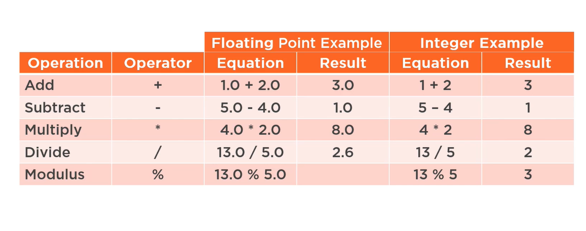
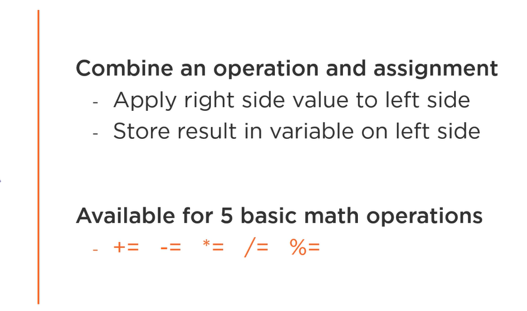
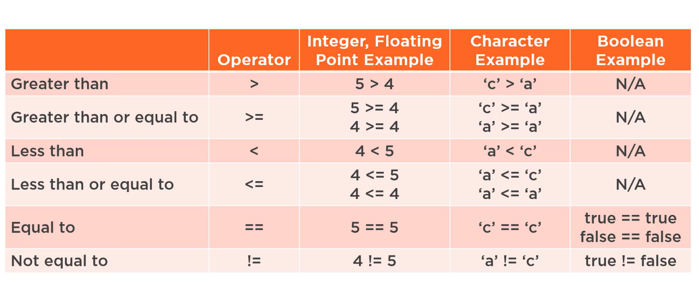
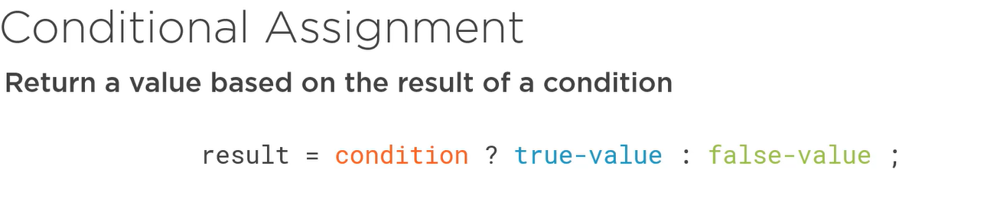
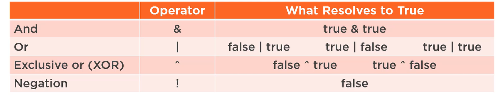
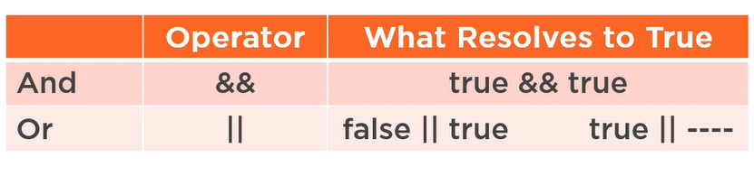

<h2> Basic Operators </h2>

<h2> Compound Assignment Operators </h2>

<h2> Relational Operators</h2>

<h2> Ternary Operator</h2>

<h2>Bitwise Operators </h2>

<h2>Conditional Logical Operators </h2>

<h2> Operators Precedence and Associativity</h2>

